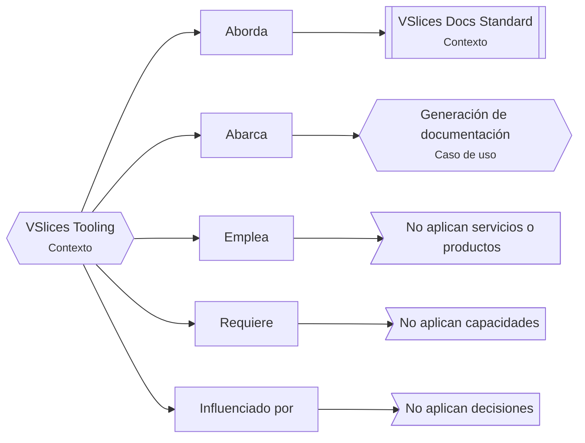
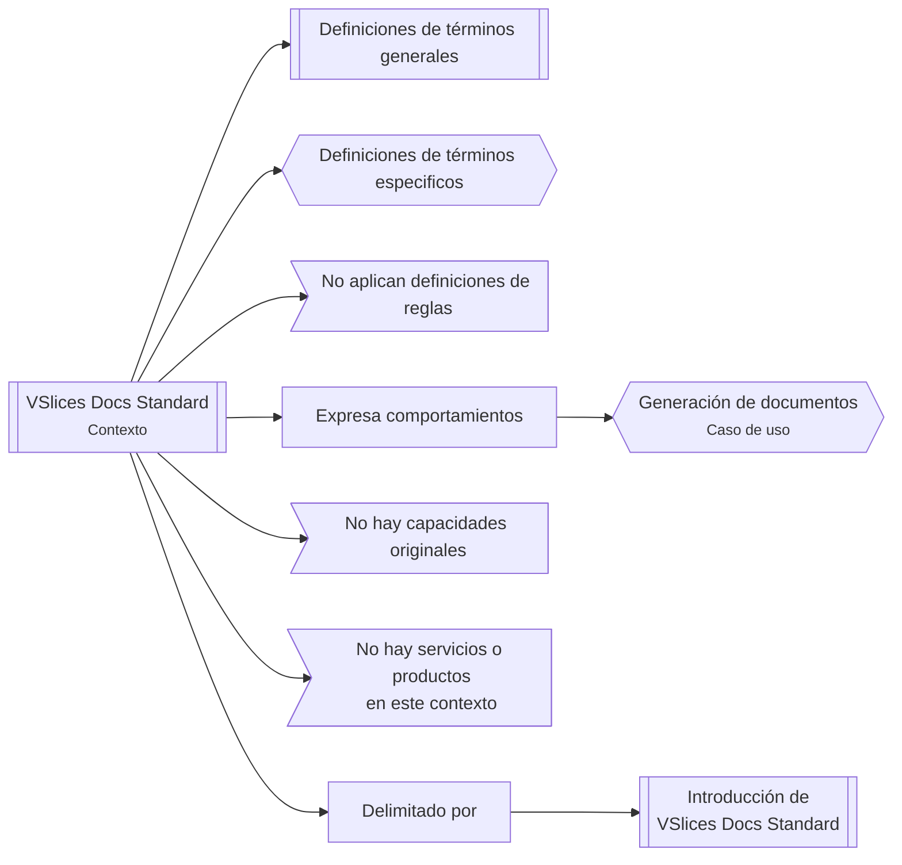

<!--

Status: draft, active, resolved, superseded, or archived.
Level: L0, L1
Scope: stage, iteration, project

-->

# Continuidad de iteración para tooling documental

## Contexto de continuidad

Dado que el tooling de VSlices está recién empezando, uno de los puntos importantes es mantener la raíz del proyecto de software de la fricción nacida al momento de definir las plantillas de VSlices Docs Standard.

Es importante mencionar que estamos trabajando esto en medio de un proceso de documentación de la suite, por lo que mantener en línea el porqué estamos haciendo esto es vital para no salir de lo que haremos.

## Continuidad en riesgo

La continuidad entre la intención documental definida por VSlices Docs Standard y los documentos Markdown mantenidos o generados para proyectos reales.

## Camino principal

Se empleará el camino de "Proyecto de software" para preservar esta continuidad, ya que se encarga de definir el contexto, scope y componentes de una solución de software desde el punto de vista de un analista de software.

A finales de esta iteración, esperamos elaborar sobre este camino de continuidad.

## Caminos secundarios

### Contexto de dominio

Se empleará el camino de "Contexto de dominio" para dar sentido y eliminar ambigüedades de las terminologías empleadas en este sistema, junto con contemplar posibles delimitaciones de contexto futuras.

## Revisiones de continuidad

| Stage           | Resultado | Cambio en continuidad | Referencia |
| --------------- | --------- | --------------------- | ---------- |
| Understanding   | Pendiente | Pendiente             | Pendiente  |
| Contextualizing | Pendiente | Pendiente             | Pendiente  |
| Planning        | Pendiente | Pendiente             | Pendiente  |
| Building        | Pendiente | Pendiente             | Pendiente  |
| Validating      | Pendiente | Pendiente             | Pendiente  |

