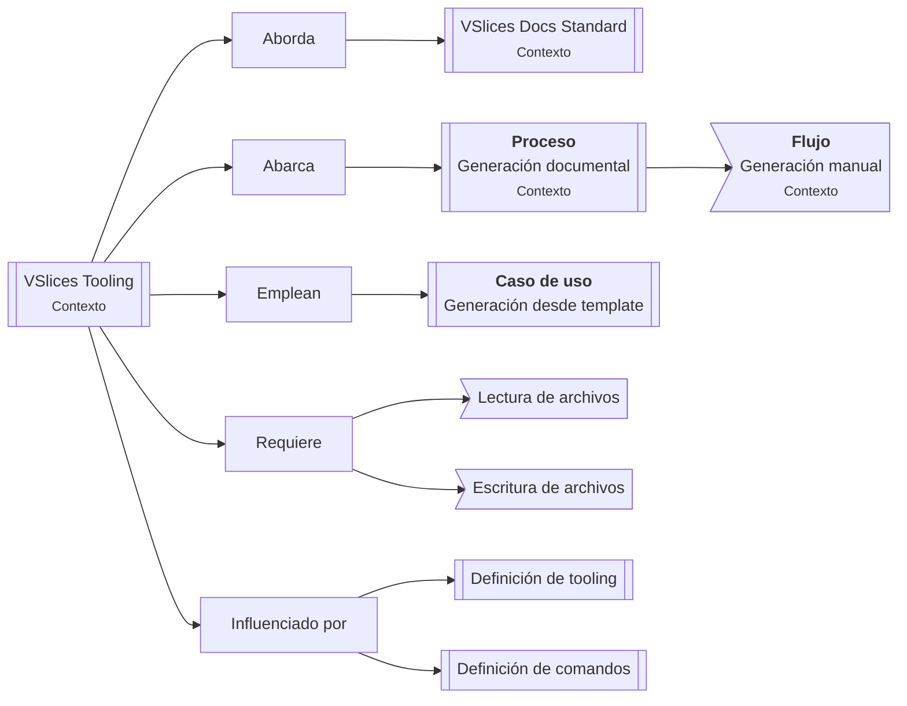
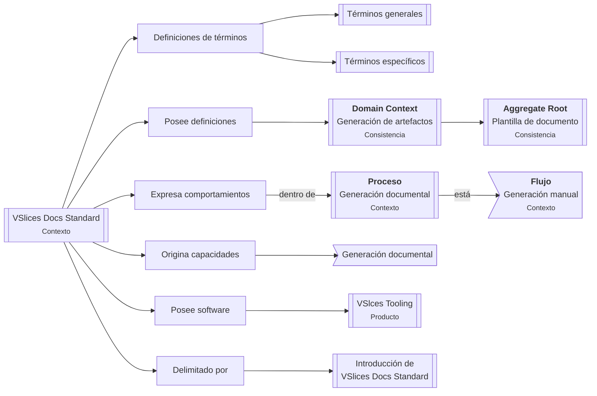
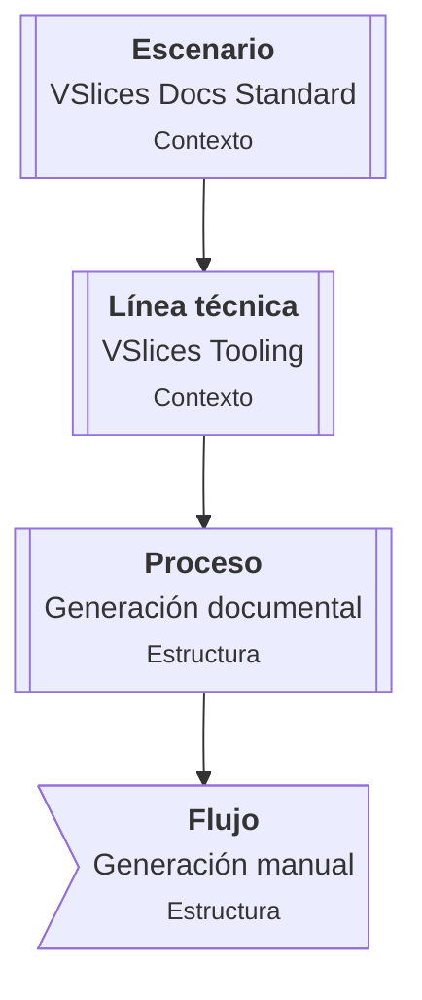

<!--

Status: draft, active, resolved, superseded, or archived.
Level: L0, L1
Scope: stage, iteration, project

-->

# Continuidad de iteración para tooling documental

## Contexto de continuidad

Dado que el tooling de VSlices está recién empezando, uno de los puntos importantes es mantener la raíz de la línea de trabajo técnica nacida desde la fricción documental al momento de definir las plantillas de VSlices Docs Standard.

Es importante mencionar que estamos trabajando esto en medio de un proceso de documentación de la suite, por lo que mantener en línea el porqué estamos haciendo esto es vital para no salir de lo que haremos.

## Continuidad en riesgo

La continuidad entre la intención documental definida por VSlices Docs Standard y los documentos Markdown mantenidos o generados para proyectos reales.

## Camino principal

Se empleará el camino de "Proyecto de software" para preservar esta continuidad, porque la iteración está convirtiendo una fricción documental observada en una línea de trabajo técnica (no de negocio) dentro de VSlices Docs Standard.

A finales de esta iteración, esperamos entender si esta línea de trabajo debe mantenerse dentro de Docs Standard, evolucionar hacia tooling propio o integrarse más adelante con VSlices Framework.

## Caminos secundarios

### Contexto de dominio

Se empleará el camino de "Contexto de dominio" para dar sentido y eliminar ambigüedades de las terminologías empleadas en este sistema, junto con contemplar posibles delimitaciones de contexto futuras.

### Escenario de trabajo

Se empleará el camino de "Escenario de trabajo" para dar sentido al escenario donde nace esta línea técnica, así como delimitar correctamente sus estructuras de trabajo.

## Revisiones de continuidad

| Stage | Resultado | Cambio en continuidad | Referencia |
| --- | --- | --- | --- |
| Start | Aprobado | Creación del mapa inicial | Pendiente | 
| Understanding | Aprobado | Se identificaron conceptos y relaciones candidatas. Los diagramas detallados se moverán a Contextualizing. | Pendiente |
| Contextualizing | Aprobado | VSlices Tooling es una línea técnica dentro de VSlices Docs Standard y de ordenaron las relaciones que en Understanding se dejaron como candidadas | Pendiente |
| Planning | Aprobado | Se generó el proceso nuevo, junto con las definiciónes de dominio de Document Template y Artifact Generation | Pendiente |
| Building | Pendiente | Pendiente | Pendiente |
| Validating | Pendiente | Pendiente | Pendiente |

