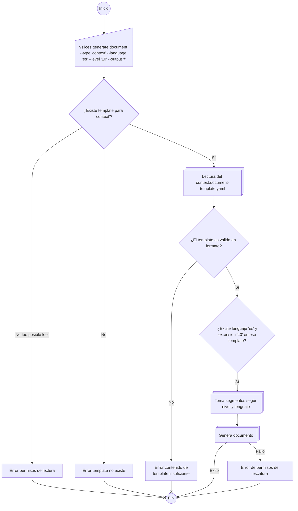

<!--
Status: draft, active, resolved, superseded, or archived.
Scope: flow-step, flow, process, work-line.
Level: L0, L1.
-->

# Generar documento desde template

## Caso de uso

Generar el esqueleto de un documento Markdown desde un template YAML, usando el tipo, idioma, nivel y output especificados por el usuario.

## Contextos y estructuras relacionados

Este caso de uso pertenece al flujo de generación documental de VSlices Tooling.

Está relacionado con:

* `process.up-context.document-generation`, que explica el contexto del proceso de generación documental
* `process.up-structure.document-generation`, que describe la estructura propuesta del proceso
* `0001.vslices-tooling-definition`, que define VSlices Tooling como proyecto propio dentro de la suite VSlices

El comportamiento se apoya en templates YAML definidos por tipo documental.

En esta iteración, se tendrá como caso de pruebas la generación de un Documento de contexto L0 en español desde `context.doc-template.yaml`.

## Consecuencias esperadas

Si el caso de uso se ejecuta correctamente:

* se genera un archivo Markdown en la ruta de salida
* el documento generado contiene front matter base
* el documento generado contiene los segmentos aplicables al nivel solicitado
* el documento generado usa el idioma solicitado
* el documento generado mantiene placeholders y comentarios guía para edición humana
* el usuario puede completar manualmente el contenido específico del documento

## Comportamiento



## Validaciones

| Validación                                                       | Razón                                                              | Error esperado                |
| ---------------------------------------------------------------- | ------------------------------------------------------------------ | ----------------------------- |
| El tipo documental fue indicado.                                 | El sistema necesita saber qué template debe buscar.                | Tipo documento requerido      |
| El template solicitado existe.                                   | No se puede generar sin template.                                  | Template no existente         |
| El nivel solicitado filtra al menos un segmento.                 | El sistema necesita seleccionar los segmentos aplicables.          | Nivel requerido               |
| El idioma solicitado esta disponible en los segmentos del nivel. | El sistema necesita seleccionar los textos correctos del template. | Idioma requerido              |
| El template no es valido en sintaxis.                            | El sistema necesita tener un documento valido.                     | Error de validez del template |
| El template puede leerse.                                        | El sistema necesita acceder al contenido del template.             | Error de acceso al template   |
| La ruta de salida permite escritura.                             | El sistema necesita persistir el documento generado.               | Error de escritura en la ruta |

## Reglas de consistencia

* El tooling genera esqueletos documentales, no contenido final.
* El contenido específico del documento debe ser completado por una persona.
* El template define qué se genera.
* El tipo documental determina qué template se busca.
* El idioma determina qué textos del template se usan.
* Para generar un documento, el idioma solicitado debe estar disponible en todos los segmentos requeridos, si no error de formato del yaml
* El nivel determina qué segmentos del template se incluyen.
* Para generar un documento, el nivel solicitado debe producir al menos un segmento.
* El documento generado debe mantenerse editable como Markdown.
* El tooling no valida calidad editorial profunda en esta iteración.
* Si el template es válido, el tooling debe respetar su estructura.

## Errores esperados

| Error                         | Significado                                           | Cuando ocurre                                                                      |
| ----------------------------- | ----------------------------------------------------- | ---------------------------------------------------------------------------------- |
| Tipo document requerido       | No se indicó qué tipo de documento se quiere generar. | El comando no recibe tipo documental.                                              |
| Idioma requerido              | No se indicó en qué idioma generar el documento.      | El comando no recibe idioma.                                                       |
| Nivel requerido               | No se indicó qué nivel documental generar.            | El comando no recibe nivel.                                                        |
| Error de validez del template | El template existe, pero no es valido.                | Se pudo acceder al archivo, pero no siguio las validaciones de dominio.            |
| Error de acceso al template   | El template existe, pero no puede leerse.             | Hay problemas de permisos, ruta o acceso al archivo.                               |
| Error de escritura en la ruta | El documento no puede guardarse.                      | La ruta de salida no existe, no permite escritura o falla al persistir el archivo. |

## Valores de entrada

* Target de generación.
  * selección: document
  * a futuro: path, project
  * Inputs del target document
    * Tipo documento.
      * obligatorio
      * tipo: texto, sin formato
      * input: "--type"
    * Lenguaje de generación.
      * obligatorio
      * tipo: texto, con formato: "<lang>-<country>"
      * input: --lang
    * Nivel de extensión.
      * opcional, default: L0
      * tipo: texto, sin formato
      * input: --level
    * Path de output
      * opcional, default: .
      * tipo: texto, con formato: ruta
      * input: --to
    * Nombre archivo
      * opcional, default: nombre template
      * tipo: texto, sin formato
      * input: --name
    * Extension
      * opcional, default: md
      * tipo: texto, sin formato
      * input: --ext

Ejemplo de comando:

- Mínimo:
```bash
vslices generate document --type context --lang es
```

- Completo:
```bash
vslices generate document --type context --lang es --level L0 --to /documents --name context --ext md
```

Los inputs son intencionalmente open-ended, excepto el target, ya que la herramienta debe generar cualquier documento que sea valido, no solo los oficiales, para dar posiblidad a extensiones del usuario

## Valores de salida

* Archivo Markdown generado.
* Nombre final del archivo generado.
* Resultado exitoso de generación.
* Error esperado cuando no se puede generar el documento.

El archivo, por defecto, será generado con este patrón: `{input[to]}/{input[type]}.{input[ext]}`, pero si se es especifica el nombre (input --name), sera así: `{input[to]}/{input[name]}.{input[ext]}`.

Ejemplos, en par comando -> archivo generado:
- "vslices generate document --type context --lang es" -> "./context.md"
- "vslices generate document --type pruebas --lang en" -> "./pruebas.md"
- "vslices generate document --type context --lang es --to ./documents" -> "./documents/context.md"
- "vslices generate document --type context --lang es --name context.iteration" -> "./documents/context.iteration.md"

Si ya existe un archivo con ese nombre, se generará otro agregando `(N)` al final.

## Capacidades relacionadas

* Lectura de archivos.
* Escritura de archivos.

## Decisiones del caso de uso

| Pregunta | Decisión |
| --- | --- |
| ¿Cuál será la estructura final exacta de `context.document-template.yaml`? | Será definida en base a lo que entregue el negocio. El tooling no impone una estructura documental semántica más allá de que el template sea válido. |
| ¿El nombre base del documento vendrá desde el template, desde el tipo documental o desde un argumento futuro? | Por ahora, el nombre base viene por defecto. |
| ¿Los errores esperados se representarán como códigos internos, mensajes humanos o ambos? | Ambos. |
| ¿La ruta de salida podrá configurarse en esta iteración o quedará fija a la ruta actual del CLI? | El documento se genera en la misma ruta de ejecución. |
| ¿El template debe permitir segmentos sin comentarios guía? | Sí. Los segmentos pueden no tener comentarios guía, pero los templates oficiales deberían ser lo más informativos posible. |
| ¿El primer slice debe soportar solo `L0` o aceptar `L1`, `L2` y `L3` si el template los declara? | Soporta los niveles que el template soporte. |

## Preguntas abiertas

- ¿Qué forma exacta tendrá el nombre base generado por defecto?
- ¿Qué códigos internos usaremos para los errores esperados?
- ¿Qué estructura mínima hará que un template sea válido sin imponer semántica documental excesiva?

