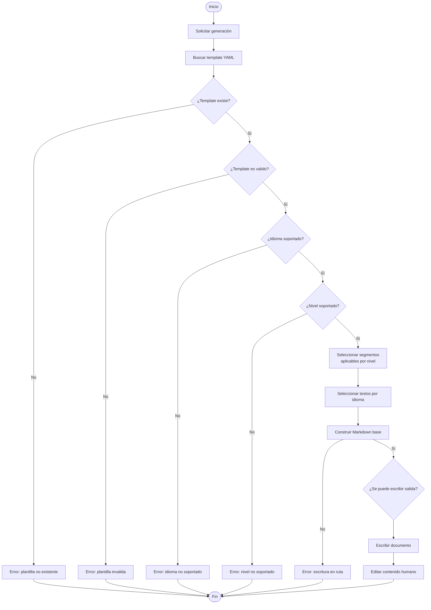

<!--
Status: draft, active, resolved, superseded, or archived.
Scope: work-line, process, flow, step.
Level: L0, L1.
-->

# Estructura del Proceso de Generación documental

## Estructura de trabajo

La generación documental se realizará a partir de templates estructurados que describen la forma base de un tipo documental.

En esta iteración, el proceso se enfocará en generar el esqueleto de un documento Markdown desde un template YAML, usando como entrada el tipo documental, el idioma y el nivel documental solicitado.

El documento generado no reemplaza la escritura humana. Su propósito es entregar una base consistente con front matter, secciones, placeholders y comentarios guía.

## Propósito

Esta estructura existe para reducir trabajo repetitivo y preservar consistencia entre documentos del mismo tipo.

Responde a la necesidad de mantener continuidad entre:

* la intención documental de VSlices Docs Standard
* los templates estructurados
* los documentos Markdown generados
* los niveles documentales como L0 y L1
* los idiomas soportados
* la edición humana posterior

## Detallado

El proceso propuesto es:

1. El usuario solicita generar un documento indicando tipo documental, idioma y nivel.
2. El generador busca el template YAML correspondiente al tipo documental.
3. El generador valida que el template exista y pueda leerse.
4. El generador valida que el idioma solicitado esté soportado.
5. El generador valida que el nivel solicitado esté soportado.
6. El generador selecciona los segmentos aplicables al nivel solicitado.
7. El generador selecciona el texto correspondiente al idioma solicitado.
8. El generador construye el Markdown base.
9. El generador escribe el documento en la ruta de salida.
10. El usuario edita el documento generado para completar contenido específico.



## Valores de entrada

* Tipo documental solicitado.
* Idioma solicitado.
* Nivel documental solicitado.
* Template YAML correspondiente al tipo documental.
* Ruta de salida.
* Convenciones documentales definidas por VSlices Docs Standard.

Ejemplo de uso esperado:

```bash
vslices generate --Type context-document --Language es --Size L0 --Output /
```

Versión corta:

```bash
vslices generate -T context-document -L es -S L0 -O /
```

## Valores de salida

* Documento Markdown generado.
* Front matter base.
* Secciones correspondientes al tipo documental.
* Placeholders para completar contenido humano.
* Comentarios guía asociados a cada segmento.
* Errores esperados cuando no se puede generar el documento.

## Puntos de dolor o riesgos

* El template YAML puede crecer demasiado si se intenta resolver lógica compleja dentro de él.
* La estructura puede volverse difícil de mantener si se agregan muchos tipos documentales demasiado pronto.
* La generación puede confundirse con documentación final, aunque solo produce un esqueleto editable.
* El CLI puede crecer antes de validar el primer caso.
* El nombre `Size` puede confundirse con tamaño físico del documento, aunque representa nivel documental.
* Los errores técnicos pueden mezclarse con errores esperados si no se modelan explícitamente.
* El soporte multilenguaje puede agregar complejidad antes de validar el flujo básico.## Decisiones del proceso

## Decisiones iniciales
| Pregunta | Decisión |
| --- | --- |
| ¿El argumento debería llamarse `--Size` o `--Level`? | Se usará `--Size`, porque evita confusión con `--Language` en formato corto. |
| ¿La versión corta debe mantenerse desde la primera iteración? | Sí. |
| ¿Qué ruta de salida usará el generador por defecto? | Por defecto usará la ruta actual del CLI y dejará ahí el documento solicitado. |
| ¿Qué ocurre si el archivo de salida ya existe? | Se generará otro archivo agregando `(N)` al final del nombre. |
| ¿El template debe incluir front matter como segmento o como metadata separada? | Debe estar al inicio del template, siguiendo la forma actual de los templates en Git. |
| ¿Cómo se representarán comentarios guía multilínea dentro del YAML? | Usando la forma estándar de YAML para textos multilínea. |
| ¿Qué tan genérico debe ser el formato antes de validar `context-document.template.yaml`? | La herramienta generará lo que exista en el template siempre que sea válido. VSlices entregará templates YAML por defecto. |
| ¿Cuál será el nombre exacto del archivo generado por defecto? | `{nombre-documento}.md`. |
| ¿Dónde buscará templates por defecto? | El sistema buscará un template con patrón `{nombre-documento}.template.yaml` en la misma ruta donde se hará el output. |
| ¿Qué ocurre si el archivo de salida ya existe? | Se generará otro archivo agregando `(N)` al final del nombre. |
| ¿La resolución de templates será extensible? | Sí, pero no en esta iteración. Se considera para una futura iteración mediante archivos de configuración. |
 